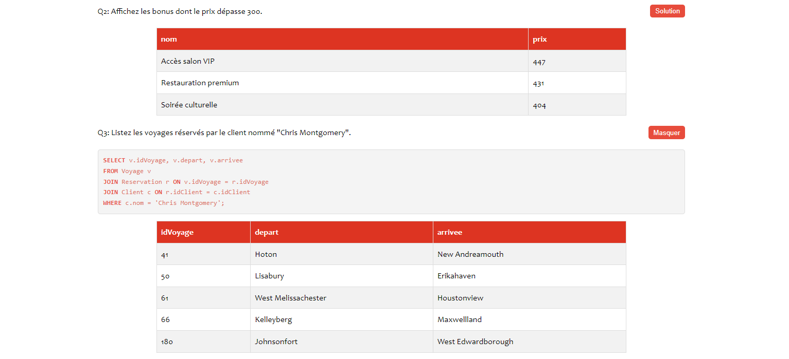

(ENG) (FR Below)

# SQL Educational Document Generator

This project automatically generates a complete SQL Practical Work document as an interactive HTML page from a SQL file. Questions, SQL queries, optional solutions, and query results are extracted and formatted. 

Example of expected SQL File :

```sql
-- Show every bonus feature above 300$.   
SELECT name, price FROM Bonus WHERE price > 300;

-- List the trips reserved by the client named "Chris Montgomery".
SELECT v.idTrip, v.departure, v.arrival
FROM Trip v
JOIN Reservation r ON v.idTrip = r.idTrip
JOIN Client c ON r.idClient = c.idClient
WHERE c.name = 'Chris Montgomery';
```
  
 Here is a screenshot of the HTML page where U can show/hide the SQL code (french)
  


## Features

1. **Question and Query Extraction**:
   - Questions must be placed in the SQL file as comments.
   - Queries associated with the questions should follow the comments.

2. **Automatic Query Execution**:
   - SQL queries are executed on a SQLite database.
   - Results are retrieved and formatted as tables.

3. **Automatic File Generation**:
   - `index.html`: A web page containing questions, optional solutions, and query result tables.
   - `script.js`: A JavaScript file to handle interactivity (toggle solutions, SQL keyword highlighting, etc.).
   - `style.css`: A CSS file for clean and modern presentation.
   - An PDM (Physical Data Model) image file, if provided, is integrated.

4. **MCD Visualization**:
   - A button allows you to show or hide an PDM image (e.g., an SVG or PNG file).

---

#### **How to Use**

1. Open a folder in VSCode containing:
   - A SQLite database file.
   - A structured SQL file with questions.
   - An optional MCD image file.

2. Execute the command in the Command Palette (Ctrl+Shift+P): **SQL-to-Doc**.
3. Provide the relative paths of the files and decide whether to include solutions.
4. The process generates an `output` folder containing the files

(FR)

# TP SQL Automatique

Ce projet génère automatiquement un TP SQL complet sous forme de page HTML interactive à partir d'un fichier SQL. Les questions, requêtes SQL, solutions optionnelles et résultats des requêtes sont extraits et mis en forme.

Voici un exemple de fichier SQL attendu :

```sql
-- Affichez les bonus dont le prix dépasse 300.
SELECT nom, prix FROM Bonus WHERE prix > 300;

-- Listez les voyages réservés par le client nommé "Chris Montgomery".
SELECT v.idVoyage, v.depart, v.arrivee
FROM Voyage v
JOIN Reservation r ON v.idVoyage = r.idVoyage
JOIN Client c ON r.idClient = c.idClient
WHERE c.nom = 'Chris Montgomery';
```

Voici une capture d'écran du fichier HTML crée :
  


## Fonctionnalités

1. **Extraction des Questions et Requêtes** :
   - Les questions doivent être placées dans le fichier SQL comme commentaires.
   - Les requêtes associées sont situées immédiatement après les commentaires.

2. **Exécution Automatique des Requêtes** :
   - Les requêtes SQL sont exécutées sur une base de données SQLite.
   - Les résultats sont récupérés et formatés en tableau.

3. **Génération de Fichiers Automatique** :
   - `index.html` : Une page HTML avec les questions, solutions optionnelles et tableaux des résultats.
   - `script.js` : Le script JavaScript pour gérer l'interactivité (afficher/masquer les solutions, mise en évidence des mots-clés SQL, etc.).
   - `style.css` : Les styles pour une présentation propre et moderne.
   - Un fichier image MPD est inclus si spécifié.

4. **Visualisation du MPD (Modèle Physique de Données)** :
   - Un bouton permet d'afficher ou de masquer une image du MPD (par exemple, un fichier SVG ou PNG).

---

#### **Utilisation**

1. Ouvrez un dossier dans VSCode contenant :
   - Une base de données SQLite.
   - Un fichier SQL structuré avec les questions.
   - Une image de MPD (facultatif).

2. Exécutez la commande dans la palette (Ctrl+Shift+P) :  **SQL-to-Doc**.
3. Renseignez les chemins relatifs des fichiers et choisissez si vous voulez inclure les solutions.
4. Le processus génère un dossier output contenant les fichiers